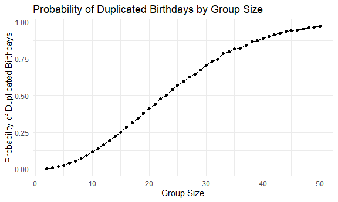

p8105_hw5_yc4584
================
Yingyu Cui
2024-11-10

``` r
library(tidyverse)
```

    ## ── Attaching core tidyverse packages ──────────────────────── tidyverse 2.0.0 ──
    ## ✔ dplyr     1.1.4     ✔ readr     2.1.5
    ## ✔ forcats   1.0.0     ✔ stringr   1.5.1
    ## ✔ ggplot2   3.5.1     ✔ tibble    3.2.1
    ## ✔ lubridate 1.9.3     ✔ tidyr     1.3.1
    ## ✔ purrr     1.0.2     
    ## ── Conflicts ────────────────────────────────────────── tidyverse_conflicts() ──
    ## ✖ dplyr::filter() masks stats::filter()
    ## ✖ dplyr::lag()    masks stats::lag()
    ## ℹ Use the conflicted package (<http://conflicted.r-lib.org/>) to force all conflicts to become errors

``` r
set.seed(1)

knitr::opts_chunk$set(
  fig.width = 6,
  fig.asp = .6,
  out.width = "90%"
)

theme_set(theme_minimal() + theme(legend.position = "bottom"))

options(
  ggplot2.continuous.colour = "viridis",
  ggplot2.continuous.fill = "viridis"
)

scale_colour_discrete = scale_colour_viridis_d
scale_fill_discrete = scale_fill_viridis_d
```

# Problem 1

## write a function for duplicated birthdays

``` r
duplicated_birthday = function(n){
  birthdays = sample(1:365, n, replace = TRUE)
  
  return(any(duplicated(birthdays)))
}
```

## then we run this 10000 times for number 2:50 and calculate the probability of duplicated birthdays

``` r
sim_birthday_results = 
  expand_grid(
    group_size = c(2:50),
    iter = 1:10000
  ) |> 
  mutate(
    results = map_lgl(group_size, duplicated_birthday)
  ) |> 
  group_by(group_size) |>
  summarize(
    prob = mean(results)
  )

sim_birthday_results
```

    ## # A tibble: 49 × 2
    ##    group_size   prob
    ##         <int>  <dbl>
    ##  1          2 0.0024
    ##  2          3 0.0085
    ##  3          4 0.0167
    ##  4          5 0.0267
    ##  5          6 0.0399
    ##  6          7 0.0521
    ##  7          8 0.0751
    ##  8          9 0.0925
    ##  9         10 0.116 
    ## 10         11 0.139 
    ## # ℹ 39 more rows

## then we make a plot showing the probability as a function of group size

``` r
birth_duplicated_plot =
  ggplot(sim_birthday_results, aes(x = group_size, y = prob)) +
  geom_point() +
  geom_line() +
  labs(
    x = "Group Size",
    y = "Probability of Duplicated Birthdays",
    title = "Probability of Duplicated Birthdays by Group Size"
  )

birth_duplicated_plot
```



Here is the comment: The plot shows the probability of duplicated
birthdays by group size. The probability increases as the group size
increases. When the group size is 23, the probability of duplicated
birthdays is 0.5. This examines the birthday paradox, which states that
in a group of 23 people, there is a 50% chance that two people share the
same birthday, and when the group size is 50, the probability is close
to 1.

# Problem 2

## when μ=0, first we establish a function for the result of the t-test

``` r
t_test_result = function(n, mu){
  x = rnorm(n, mean = mu, sd = 5)
  
  t_test = t.test(x, mu = 0, conf.level = 0.95)
  
  tidy_result = t_test |> 
    broom::tidy()
  
  mean = tidy_result$estimate
  p_value = tidy_result$p.value
  
  tibble(mean = mean, 
         p_value = p_value)
}
```

## Now we obtain a data frame with the results of 5000 t-tests

``` r
sim_t_test_results = 
  expand_grid(
    n = 30,
    mu = 0,
    iter = 1:5000
  ) |> 
  mutate(
   results = map2(n, mu, t_test_result)
  ) |> 
  unnest(results)
```

## now I will repeat the above steps for μ=1:6

``` r
sim_t_test_results_1_6 = 
  expand_grid(
    n = 30,
    mu = c(1, 2, 3, 4, 5, 6),
    iter = 1:5000
  ) |> 
  mutate(
    results = map2(n, mu, t_test_result)
  ) |> 
  unnest(results)
```

## Make a plot showing the association of power and different values of μ

``` r
# first we calculate the power
sim_t_test_results_all = 
  bind_rows(sim_t_test_results, sim_t_test_results_1_6)

power_results = 
  sim_t_test_results_all |> 
  group_by(mu) |> 
  summarize(
    power = mean(p_value < 0.05)
  )

power_plot =
  ggplot(power_results, aes(x = mu, y = power)) +
  geom_line() +
  geom_point() +
  scale_x_continuous(breaks = 0:6) +
  labs(
    x = "True Mean (μ)",
    y = "Power (Proportion of Null Rejected)",
    title = "Power of the Test as a Function of Effect Size (μ)"
  )

power_plot
```


Comment on the plot: The plot shows that the stronger effect size (which
is the more mu is away from 0) is, the higher the power of the test is
and the more likely the test is to correctly reject the null hypothesis.
When the true mean is 0, the power is the lowest, which is around 0.05.
When the true mean is 6, the power is the highest, which is around 1.

## Make one overlapping plots, blue one is showing the average estimate of μ^ on the y axis and the true value of μ on the x axis; the red one is the average estimate of μ^ only in samples for which the null was rejected on the y axis and the true value of μ on the x axis.

``` r
# first calculate the average estimate of μ^ for two plots
mean_results = 
  sim_t_test_results_all |> 
  group_by(mu) |> 
  summarize(
    avg_estimate_all = mean(mean),
    avg_estimate_rejected = mean(mean[p_value < 0.05])
  ) |> 
  pivot_longer(
    cols = c(avg_estimate_all, avg_estimate_rejected),
    names_to = "type",
    values_to = "avg_estimate"
  ) |> 
  mutate(type = recode(type, 
                        avg_estimate_all = "All Samples", 
                        avg_estimate_rejected = "Rejected Samples"))

# Now I will make an overlapping plot
comparison_plot = 
  ggplot(mean_results, aes(x = mu, y = avg_estimate, color = type)) +
  geom_line() +
  geom_point() +
  labs(
    x = "True Mean (μ)",
    y = "Average Estimate of μ^",
    title = "Average Estimate of μ^ for All Samples and Only Rejected Samples",
    color = "Type"
  ) +
  scale_x_continuous(breaks = 0:6) +
  scale_color_manual(values = c("All Samples" = "blue", "Rejected Samples" = "red"))
  

comparison_plot
```


comment on the plot: the sample average of μ^ across tests for which the
null is rejected is not approximately equal to the true value of μ. This
is because in the samples that the null is rejected, the samples tend to
have a larger effect size and also more likely to reject the null
hypothesis, which could skewed the average of μ^ upwards in these
samples. And this is the reason why the average estimate of μ^ is larger
than the true value of μ. However, when the true mean is more away from
0, the average estimate of μ^ is closer to the true value of μ. This is
because in these sample, there is a higher power of the test, which
means the proportion of test rejected is higher, and the average
estimate of μ^ is more likely to be closer to the true value of μ.

# Problem 3

## First I will load the data in a relative path

``` r
homicide_df = read_csv("data/homicide_data.csv")
```

    ## Rows: 52179 Columns: 12
    ## ── Column specification ────────────────────────────────────────────────────────
    ## Delimiter: ","
    ## chr (9): uid, victim_last, victim_first, victim_race, victim_age, victim_sex...
    ## dbl (3): reported_date, lat, lon
    ## 
    ## ℹ Use `spec()` to retrieve the full column specification for this data.
    ## ℹ Specify the column types or set `show_col_types = FALSE` to quiet this message.

``` r
homicide_df
```

    ## # A tibble: 52,179 × 12
    ##    uid        reported_date victim_last  victim_first victim_race victim_age
    ##    <chr>              <dbl> <chr>        <chr>        <chr>       <chr>     
    ##  1 Alb-000001      20100504 GARCIA       JUAN         Hispanic    78        
    ##  2 Alb-000002      20100216 MONTOYA      CAMERON      Hispanic    17        
    ##  3 Alb-000003      20100601 SATTERFIELD  VIVIANA      White       15        
    ##  4 Alb-000004      20100101 MENDIOLA     CARLOS       Hispanic    32        
    ##  5 Alb-000005      20100102 MULA         VIVIAN       White       72        
    ##  6 Alb-000006      20100126 BOOK         GERALDINE    White       91        
    ##  7 Alb-000007      20100127 MALDONADO    DAVID        Hispanic    52        
    ##  8 Alb-000008      20100127 MALDONADO    CONNIE       Hispanic    52        
    ##  9 Alb-000009      20100130 MARTIN-LEYVA GUSTAVO      White       56        
    ## 10 Alb-000010      20100210 HERRERA      ISRAEL       Hispanic    43        
    ## # ℹ 52,169 more rows
    ## # ℹ 6 more variables: victim_sex <chr>, city <chr>, state <chr>, lat <dbl>,
    ## #   lon <dbl>, disposition <chr>

Describe the raw data: The data contains 52179 observations and 12
variables. It is a data set of homicides across major United States. The
variables include the unique code for victim, the case reported date,
the victim imformation including name, gender, age and race, the
incident information about the location and final disposition of the
case. For this data, only the reported date and latitude and longitude
of the incident location are numeric, and the rest are character
variables.

## Create variable and summarize

``` r
# create a new variable for the city and state
homicide_df =
  homicide_df |> 
  mutate(city_state = paste(city, state, sep = ", "))

homicide_df
```

    ## # A tibble: 52,179 × 13
    ##    uid        reported_date victim_last  victim_first victim_race victim_age
    ##    <chr>              <dbl> <chr>        <chr>        <chr>       <chr>     
    ##  1 Alb-000001      20100504 GARCIA       JUAN         Hispanic    78        
    ##  2 Alb-000002      20100216 MONTOYA      CAMERON      Hispanic    17        
    ##  3 Alb-000003      20100601 SATTERFIELD  VIVIANA      White       15        
    ##  4 Alb-000004      20100101 MENDIOLA     CARLOS       Hispanic    32        
    ##  5 Alb-000005      20100102 MULA         VIVIAN       White       72        
    ##  6 Alb-000006      20100126 BOOK         GERALDINE    White       91        
    ##  7 Alb-000007      20100127 MALDONADO    DAVID        Hispanic    52        
    ##  8 Alb-000008      20100127 MALDONADO    CONNIE       Hispanic    52        
    ##  9 Alb-000009      20100130 MARTIN-LEYVA GUSTAVO      White       56        
    ## 10 Alb-000010      20100210 HERRERA      ISRAEL       Hispanic    43        
    ## # ℹ 52,169 more rows
    ## # ℹ 7 more variables: victim_sex <chr>, city <chr>, state <chr>, lat <dbl>,
    ## #   lon <dbl>, disposition <chr>, city_state <chr>

``` r
# summarize
city_summary = 
  homicide_df |> 
  group_by(city_state) |> 
  summarize(
    city_homicides = n(),
    unsolved_homicides = sum(disposition %in% c("Closed without arrest", "Open/No arrest"))
  )

city_summary
```

    ## # A tibble: 51 × 3
    ##    city_state      city_homicides unsolved_homicides
    ##    <chr>                    <int>              <int>
    ##  1 Albuquerque, NM            378                146
    ##  2 Atlanta, GA                973                373
    ##  3 Baltimore, MD             2827               1825
    ##  4 Baton Rouge, LA            424                196
    ##  5 Birmingham, AL             800                347
    ##  6 Boston, MA                 614                310
    ##  7 Buffalo, NY                521                319
    ##  8 Charlotte, NC              687                206
    ##  9 Chicago, IL               5535               4073
    ## 10 Cincinnati, OH             694                309
    ## # ℹ 41 more rows

## For the city of Baltimore, MD, we process the data as following:

``` r
# filter the data for Baltimore, MD
baltimore_homicides = 
  city_summary |> 
  filter(city_state == "Baltimore, MD")

# calculate the proportion of unsolved homicides
baltimore_unsolved_prop = 
  prop.test(
    baltimore_homicides$unsolved_homicides, baltimore_homicides$city_homicides
    )

# clean and pull the estimate and confidence interval
tidy_result = broom::tidy(baltimore_unsolved_prop)
estimate = 
  tidy_result |> 
  pull(estimate)

conf_low = tidy_result |>  pull(conf.low)
conf_high = tidy_result |>  pull(conf.high)
confidence_interval =
  paste("(", conf_low, ", ", conf_high, ")", sep = "")

estimate
```

    ##         p 
    ## 0.6455607

``` r
confidence_interval
```

    ## [1] "(0.627562457662644, 0.663159860401662)"

## run prop.test for each of the cities and create a tidy dataframe with estimated proportions and CIs

``` r
# first we create a function for prop.test
prop_test = function(unsolved_homicides, city_homicides)
  {
  prop_result = prop.test(unsolved_homicides, city_homicides)
  
  tidy_result = broom::tidy(prop_result)
  
  estimate = 
    tidy_result |> 
    pull(estimate)
  
  conf_low = tidy_result |>  pull(conf.low)
  conf_high = tidy_result |>  pull(conf.high)
  confidence_interval =
    paste("(", conf_low, ", ", conf_high, ")", sep = "")
  
  tibble(estimate = estimate,
         conf_low = conf_low,
         conf_high = conf_high,
         confidence_interval = confidence_interval)
}

# then we run the prop.test for each city
city_summary_with_prop = 
  city_summary |> 
  mutate(
    prop_test_results = map2(unsolved_homicides, city_homicides, prop_test)
  ) |> 
  unnest(prop_test_results)
```

    ## Warning: There was 1 warning in `mutate()`.
    ## ℹ In argument: `prop_test_results = map2(unsolved_homicides, city_homicides,
    ##   prop_test)`.
    ## Caused by warning in `prop.test()`:
    ## ! Chi-squared近似算法有可能不准

## Create a plot that shows the estimates and CIs for each city

``` r
city_summary_with_prop_plot = 
  city_summary_with_prop |>
  mutate(city_state = fct_reorder(city_state, estimate)) |> 
           ggplot(aes(x = city_state, y = estimate)) +
           geom_point(color = "blue") +
           geom_errorbar(aes(ymin = conf_low, ymax = conf_high), color = "red") +
           coord_flip() +
           labs(
             title = "Proportion and CIs of Unsolved Homicides by City",
             x = "City",
             y = "Estimated Proportion and CIs of Unsolved Homicides"
  )

city_summary_with_prop_plot
```


